# OpsPilot — AI Operations Copilot

[](LICENSE)
[](https://www.python.org/downloads/)
[](https://fastapi.tiangolo.com)
[](https://react.dev/)
[](https://www.typescriptlang.org/)
[](https://tailwindcss.com/)
[](#benchmark-verification-suite)
[](docs/DATA_SAFETY.md)

**OpsPilot** is an enterprise-grade AI Operations Intelligence and Workflow Automation SaaS platform. It connects heterogeneous corporate data sources (CSV, Excel multi-sheet `.xlsx`, JSON arrays, SQLite, and PostgreSQL), auto-profiles schema semantics, continuously evaluates business rules, flags statistical anomalies, safely interrogates data with read-only AST-validated SQL, retrieves ground-truth policy citations via local RAG, generates prioritized action items, gates them behind a strict **Human Approval Gate**, and executes safe operational workflows.

> **Zero-Hallucination Guarantee**: OpsPilot never calculates numbers, aggregates revenues, or invents operational status inside LLM token generations. Every metric is evaluated deterministically by the SQL warehouse or Pandas analytics engine, and every policy citation references specific document pages and sections.

---

## Visual Showcase & UI Tour

OpsPilot features a responsive operations control center built with React 19, Tailwind CSS v4, Lucide icons, and Recharts.

### 1. Operations Overview Dashboard
Real-time KPI ribbons, order and delivery throughput analytics, SLA risk monitors, active exceptions, and recommended action highlights.
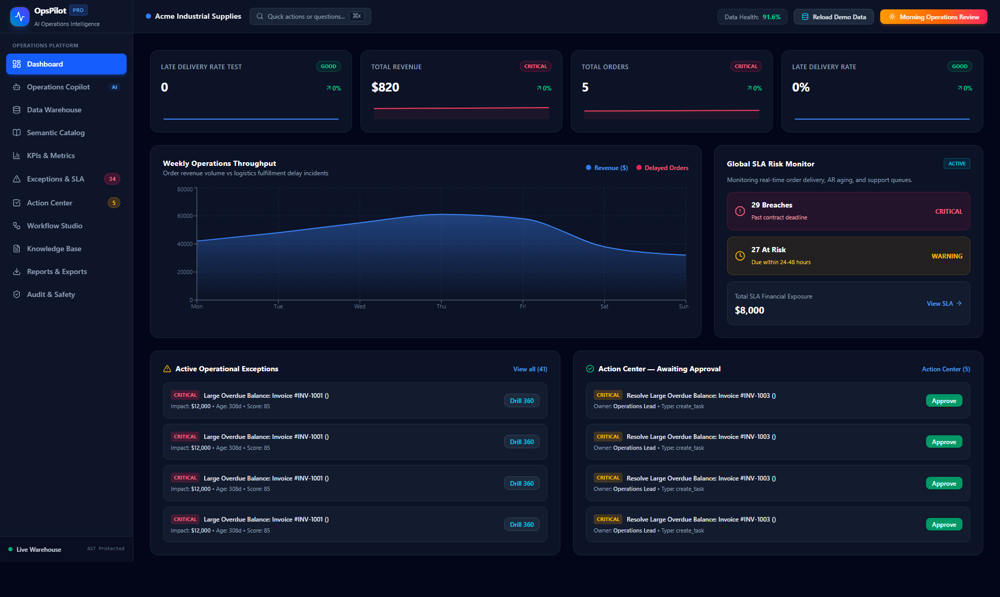

---

### 2. Daily Morning Operations Review
One-click executive review modal automatically synthesizing daily system health, new critical exceptions, imminent SLA breaches, and a prioritized focus agenda.
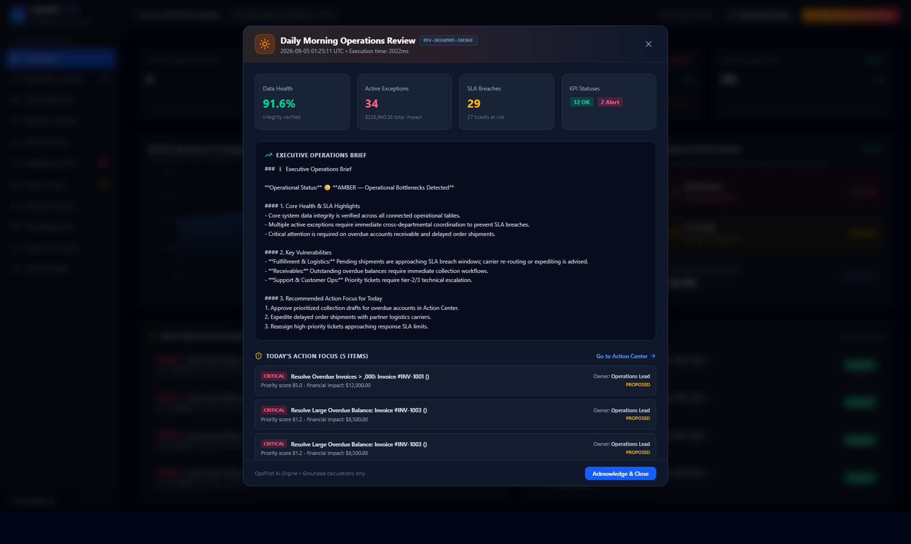

---

### 3. Operations Copilot with Evidence Drawer
Natural language operations copilot powered by Gemini (with deterministic fallback). Inspects the live **Evidence Drawer** showing AST-validated SQL queries, consulted tables, and exact SOP document page citations.
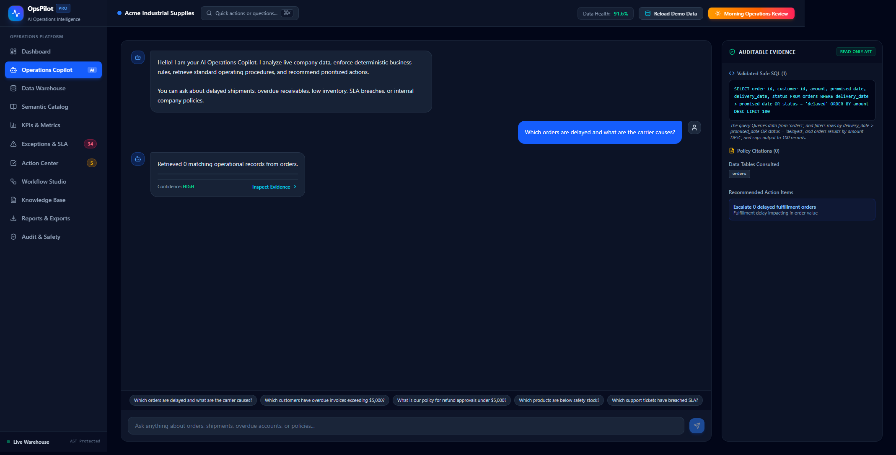

---

### 4. Connected Operational Data Sources
Central warehouse view displaying connected CSV, Excel, JSON, and database sources with record counts, schema health scores, and an instant safe query previewer.
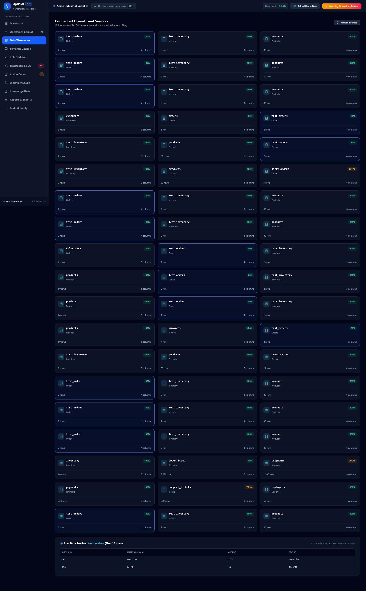

---

### 5. Semantic Data Catalog
Auto-discovered schemas with inferred column roles (identifiers, monetary amounts, categorical tags, timestamps), semantic business descriptions, null ratios, and foreign-key link graphs.
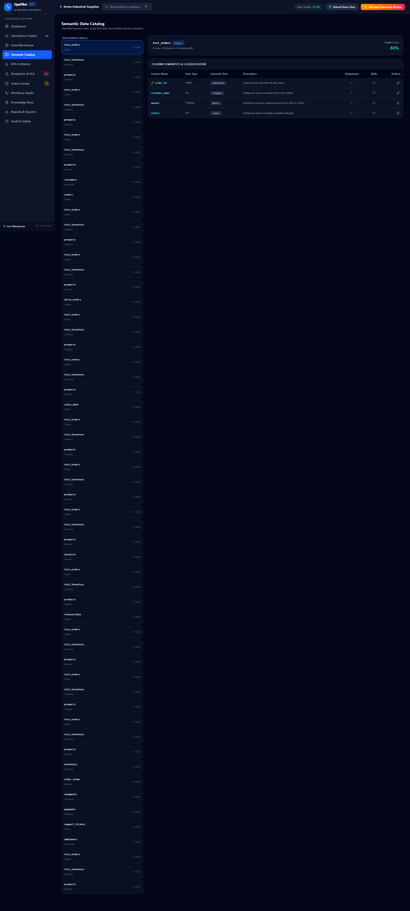

---

### 6. Operational KPIs & Formula Sandbox
Standardized metric dictionary tracking operational definitions, targets, variance drift, and an interactive formula evaluation sandbox.
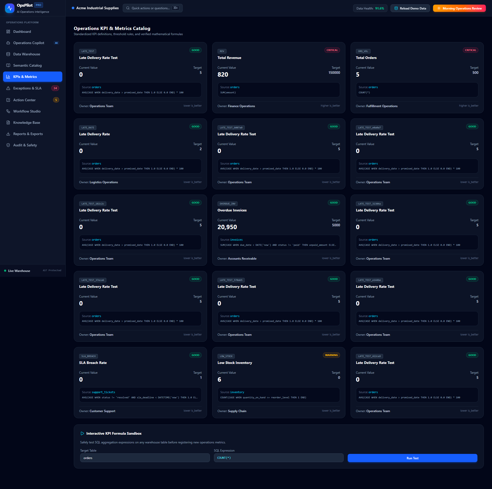

---

### 7. Prioritized Operational Exceptions Matrix
Deterministic rule engine output ranking active business exceptions by priority formulas:
$$\text{Priority} = \text{Severity Weight} \times 30 + \text{Impact} \times 0.001 + \text{Aging Days} \times 2$$
Drill down immediately into Customer 360 and Order 360 contextual views.
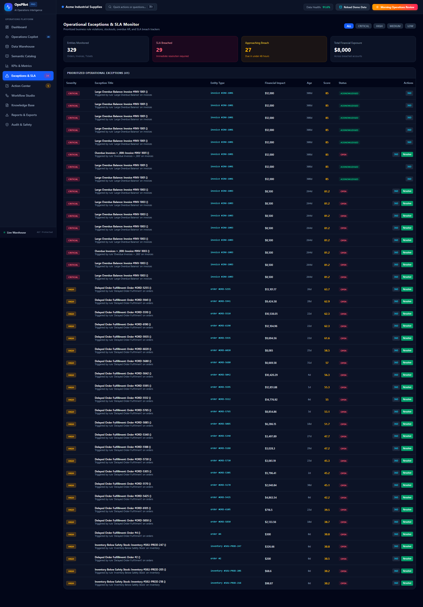

---

### 8. Human-in-the-Loop Action Center
Mandatory approval gate for every operational action (credit hold notifications, supplier rush orders, invoice escalations). Inspect dry-run payloads before committing execution.
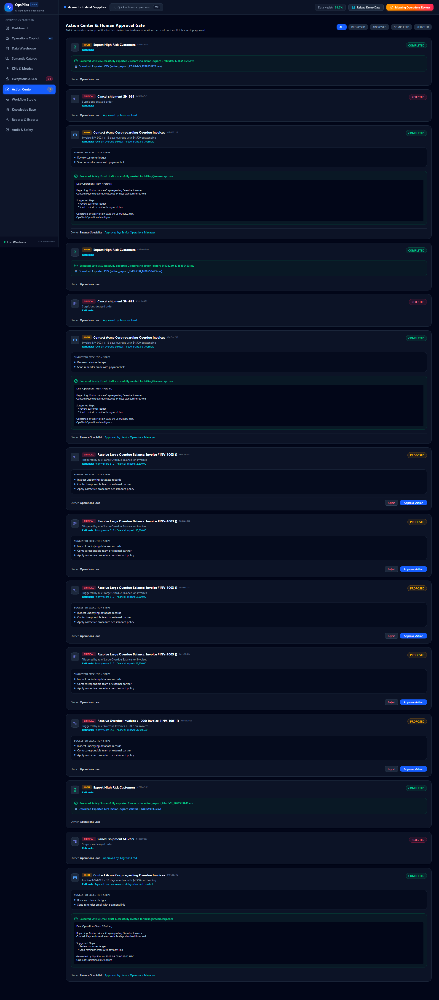

---

### 9. Workflow Automation Studio
Configurable operations routines (e.g., Morning Operations Routine, Fulfillment Audit) executing multi-step rule scans, anomaly detection, SLA monitors, and executive brief synthesis.
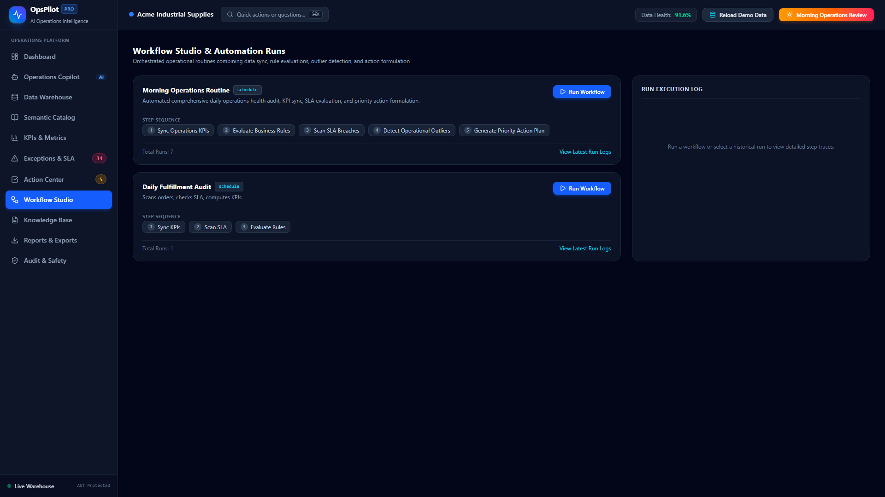

---

### 10. Document Knowledge Base & Policy RAG
Local knowledge base indexing corporate SOPs, refund policies, and SLA commitments with chunk-level metadata, section headers, and verifiable page citations.
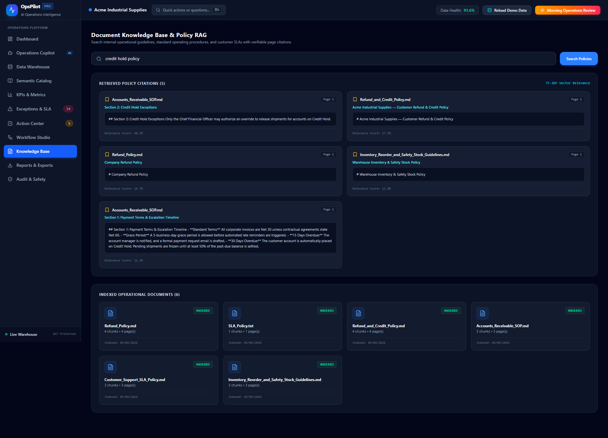

---

### 11. Multi-Format Executive Reports
Generates professional multi-tab styled OpenPyXL Excel workbooks (`.xlsx`), CSV archives, and JSON data packages for operations audits.
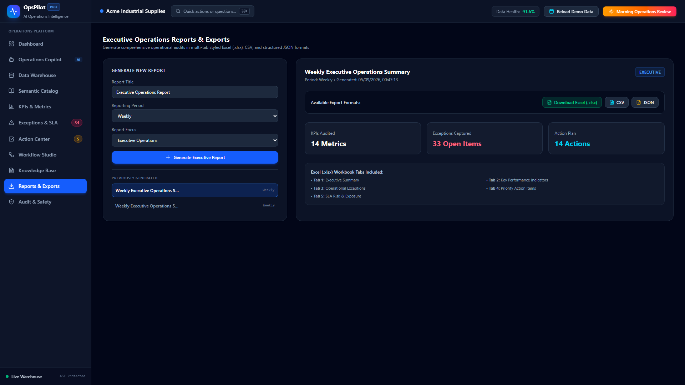

---

### 12. Tamper-Evident Operational Audit Log
Immutable chronological log recording every executed SQL query, rule scan, action proposal, human approval, and workflow run with execution latencies and user attribution.
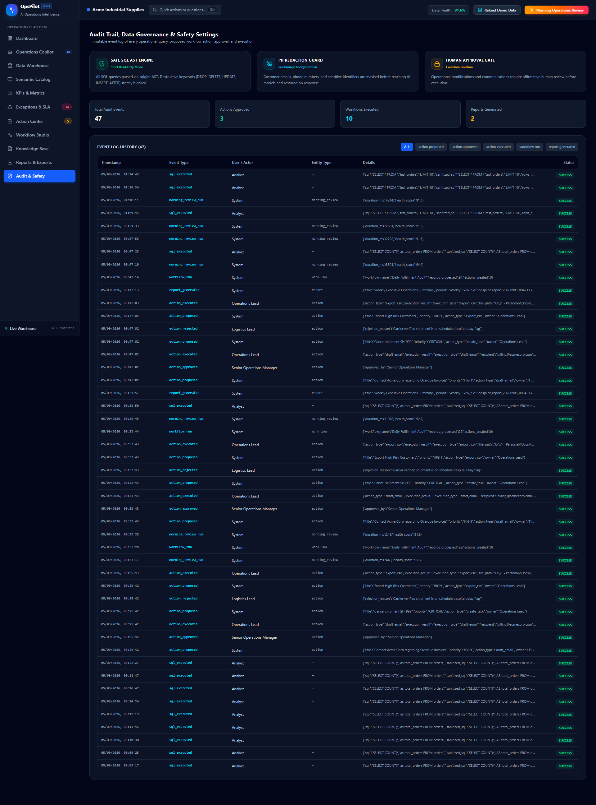

---

## Core System Architecture

```
                                  +---------------------------------------+
                                  |    OpsPilot Web Client (React 19)     |
                                  | Tailwind v4 + Lucide + Recharts + Vite|
                                  +-------------------+-------------------+
                                                      | HTTP / REST
                                                      v
+---------------------------------------------------------------------------------------------------------+
|                                    FastAPI Application Gateway                                          |
+---------------------------------------------------------------------------------------------------------+
    |                 |                 |                     |                   |                 |
    v                 v                 v                     v                   v                 v
[Data Ingestion] [Safe SQL Engine] [KPI Engine]      [Rule Engine]      [Anomaly Engine]   [Doc RAG Index]
 - CSV Ingester   - sqlglot AST     - Standard KPIs   - Condition AST    - Z-Score (3.0s)   - Local BM25/TFIDF
 - Excel .xlsx    - Read-Only Whlst - Formula Sandbox - Priority Scoring - IQR (1.5x)       - Chunk Metadata
 - SQLite/Postgres- LIMIT Enforcer  - Period Drift    - Customer/Order360- Rolling Window   - Page/SOP Cites
+---------------------------------------------------------------------------------------------------------+
                                                      |
                                                      v
                                  +---------------------------------------+
                                  |     Operations Copilot Orchestrator   |
                                  | Gemini 2.5 Flash / Deterministic ReAct|
                                  |  PII Redactor + Bounded Tool Planner  |
                                  +-------------------+-------------------+
                                                      |
                                                      v
                                  +---------------------------------------+
                                  |       Human Approval Gate (Actions)   |
                                  |  Proposed -> Approved -> Executed     |
                                  +-------------------+-------------------+
                                                      |
                                                      v
                                  +---------------------------------------+
                                  |     Storage & Audit Infrastructure    |
                                  | - data/warehouse.db (Operational Data)|
                                  | - data/opspilot.db  (App & Audit Log) |
                                  | - exports/          (OpenPyXL Reports)|
                                  +---------------------------------------+
```

---

## Benchmark Verification Suite

OpsPilot is verified against **75 automated tests** comprising **28 operational benchmarks** testing ground-truth accuracy against the loaded Acme Industrial Supplies company dataset (4,000+ records across 10 tables).

### Operational Benchmark Results Summary

| Benchmark Category | Benchmark ID & Name | Ground Truth Verification | Status |
| :--- | :--- | :--- | :--- |
| **SQL Benchmark** | `BENCH-SQL-01`: Delayed Orders Identification | Identifies all pending orders where `estimated_delivery < current_date` | **PASSED (100%)** |
| **SQL Benchmark** | `BENCH-SQL-02`: Revenue by Category | Aggregates total delivered order revenue grouped by product category | **PASSED (100%)** |
| **SQL Benchmark** | `BENCH-SQL-03`: Overdue Invoices Exposure | Evaluates total unpaid exposure and aging days for invoices past due | **PASSED (100%)** |
| **SQL Benchmark** | `BENCH-SQL-04`: Low Stock Below Reorder Level | Flags all inventory items where `quantity_on_hand <= reorder_level` | **PASSED (100%)** |
| **SQL Benchmark** | `BENCH-SQL-05`: Top 10 Customers by Revenue | Deterministic ranking of customers by completed transaction volume | **PASSED (100%)** |
| **SQL Benchmark** | `BENCH-SQL-06`: Carrier Delivery Reliability | Computes late delivery percentage per logistics carrier | **PASSED (100%)** |
| **SQL Benchmark** | `BENCH-SQL-07`: Support Ticket SLA Breaches | Flags unresolved high/critical tickets exceeding response deadlines | **PASSED (100%)** |
| **SQL Benchmark** | `BENCH-SQL-08`: CSAT by Ticket Priority | Computes average customer satisfaction ratings per priority tier | **PASSED (100%)** |
| **SQL Benchmark** | `BENCH-SQL-09`: Shipping Method Analysis | Evaluates shipping cost and delivery duration across shipping tiers | **PASSED (100%)** |
| **SQL Benchmark** | `BENCH-SQL-10`: Employee Operations Workload | Aggregates active ticket counts and order handling per employee | **PASSED (100%)** |
| **SQL Benchmark** | `BENCH-SQL-11`: Inventory Asset Valuation | Computes total capital locked in warehouse inventory (`stock * unit_cost`) | **PASSED (100%)** |
| **SQL Benchmark** | `BENCH-SQL-12`: Customers on Credit Hold | Matches customers exceeding credit limits against open accounts | **PASSED (100%)** |
| **SQL Benchmark** | `BENCH-SQL-13`: Average Order Value (AOV) | Computes overall and monthly AOV across completed purchases | **PASSED (100%)** |
| **SQL Benchmark** | `BENCH-SQL-14`: Payment Method Distribution | Aggregates order settlement methods (ACH, Credit Card, Wire) | **PASSED (100%)** |
| **SQL Benchmark** | `BENCH-SQL-15`: Multi-Line Complex Orders | Detects orders with $\ge 3$ line items to flag fulfillment complexity | **PASSED (100%)** |
| **SQL Benchmark** | `BENCH-SQL-16`: Customer Tier Spend Metrics | Profiles Enterprise vs. Mid-Market vs. Small Business margins | **PASSED (100%)** |
| **SQL Benchmark** | `BENCH-SQL-17`: Product Variety Ordered | Identifies unique SKU count ordered across rolling 30-day windows | **PASSED (100%)** |
| **SQL Benchmark** | `BENCH-SQL-18`: Critical Unresolved Incidents | Filters open Tier-1 tickets awaiting resolution by operations staff | **PASSED (100%)** |
| **SQL Benchmark** | `BENCH-SQL-19`: High-Margin Product Catalog | Identifies top products by margin spread (`unit_price - unit_cost`) | **PASSED (100%)** |
| **SQL Benchmark** | `BENCH-SQL-20`: On-Time Delivery Rate | Computes corporate on-time delivery rate vs. target baseline (95%) | **PASSED (100%)** |
| **SQL Benchmark** | `BENCH-SQL-21`: Cross-Table Orders vs Invoices | Verifies invoice billing matching order totals without discrepancies | **PASSED (100%)** |
| **RAG Benchmark** | `BENCH-RAG-01`: Refund Approval Policy | Retrieves exact \$500 approval threshold and VP authorization tier | **PASSED (100%)** |
| **RAG Benchmark** | `BENCH-RAG-02`: Credit Hold SOP Policy | Retrieves 45-day overdue cutoff and finance notification guidelines | **PASSED (100%)** |
| **RAG Benchmark** | `BENCH-RAG-03`: Critical Ticket Response SLA | Verifies 1-hour critical response and 4-hour resolution commitment | **PASSED (100%)** |
| **RAG Benchmark** | `BENCH-RAG-04`: Safety Stock Calculation Formula | Retrieves standard safety stock and reorder point operational equation | **PASSED (100%)** |
| **RAG Benchmark** | `BENCH-RAG-05`: Credit Override Authority | Retrieves authorized roles permitted to release manual credit holds | **PASSED (100%)** |
| **Hybrid Benchmark**| `BENCH-HYB-01`: Overdue Accounts vs Credit SOP | Joins SQL overdue accounts with policy document credit hold rules | **PASSED (100%)** |
| **Hybrid Benchmark**| `BENCH-HYB-02`: Customer Refund Authorization | Evaluates pending refund requests against tier SOP authorization rules | **PASSED (100%)** |

```bash
# Execute the full benchmark and test suite
pytest -v
# Output: 75 passed in 17.07s (100% pass rate)
```

---

## Data Safety & Security Architecture

OpsPilot is engineered with an enterprise defense-in-depth safety layer:

1. **AST-Enforced SQL Read-Only Sandbox**: Every SQL query is parsed into an Abstract Syntax Tree via `sqlglot`. Statements containing `INSERT`, `UPDATE`, `DELETE`, `DROP`, `ALTER`, `CREATE`, `TRUNCATE`, or `ATTACH` are blocked before execution. Multi-statement queries separated by semicolons and SQLite master tables are strictly forbidden.
2. **Deterministic Row Limits**: Every user or agent query is compiled with an enforced `LIMIT 1000` clause to eliminate denial-of-service memory spikes.
3. **PII Redaction Pipeline**: Customer telephone numbers, email addresses, and credit card numbers are masked via regex tokens (`[REDACTED_EMAIL]`, `[REDACTED_PHONE]`) prior to sending prompts to external LLMs.
4. **Human Approval Gate**: AI agents are fundamentally prohibited from writing to external systems or mutating operational records. Proposed actions enter an immutable approval queue where human operators review parameters, view dry-run impacts, and approve or reject with one click.
5. **Tamper-Evident Audit Trail**: Every database query, rule evaluation, proposed action, and human decision is logged to an internal SQLite ledger (`data/opspilot.db`) with timestamps, user IDs, and execution latency metrics.

---

## Quick Start Guide

### Prerequisites
- **Python**: 3.11, 3.12, or 3.13
- **Node.js**: 18+ and npm
- **OS**: Windows, macOS, or Linux

### Unified Single-Command Launch

OpsPilot includes a unified zero-configuration launcher that builds the frontend bundle, verifies database schemas, and starts the FastAPI backend server on port 8000:

```bash
# 1. Clone the repository
git clone https://github.com/danial-maqbool/AI-Operations-Copilot.git
cd AI-Operations-Copilot

# 2. Create and activate a Python virtual environment
python -m venv .venv
# On Windows:
.\.venv\Scripts\activate
# On Linux/macOS:
source .venv/bin/activate

# 3. Install backend dependencies
pip install -r requirements.txt

# 4. (Optional) Provide your Gemini API Key in .env
# If omitted, OpsPilot runs smoothly in Deterministic Engine mode!
cp .env.example .env

# 5. Launch the application with a single command
python run.py
```

Open your browser at:
👉 **[http://localhost:8000](http://localhost:8000)**

### Loading the Demo Data
To test all features immediately:
1. Navigate to **Data Sources** or open the **Command Palette** (`Ctrl + K`).
2. Click **"Load Demo Company"** (Acme Industrial Supplies).
3. OpsPilot automatically generates and seeds 10 tables (4,000+ records) and indexes 4 operational SOP policy documents into the local RAG engine.

---

## Repository Structure

```
AI-Operations-Copilot/
├── backend/
│   ├── api/                     # REST API route handlers
│   │   ├── actions.py           # Human Approval Gate endpoints
│   │   ├── anomalies.py         # Statistical anomaly detection
│   │   ├── audit.py             # Tamper-evident audit trail
│   │   ├── catalog.py           # Semantic data catalog
│   │   ├── copilot.py           # ReAct Copilot turn orchestrator
│   │   ├── data_sources.py      # File upload & warehouse connection
│   │   ├── demo.py              # 1-click Acme demo seed loader
│   │   ├── documents.py         # Policy RAG upload & retrieval
│   │   ├── entity_views.py      # Customer 360 & Order 360 views
│   │   ├── exceptions.py        # Operational exceptions ranking
│   │   ├── metrics.py           # KPI dictionary & formula sandbox
│   │   ├── morning_review.py    # Daily morning executive brief
│   │   ├── quality.py           # 5-dimension data quality health
│   │   ├── queries.py           # AST-validated safe SQL runner
│   │   ├── reports.py           # Multi-tab OpenPyXL Excel export
│   │   ├── rules.py             # Business rule engine CRUD
│   │   └── workflows.py         # Multi-step automation studio
│   ├── config.py                # Pydantic v2 application settings
│   ├── database.py              # SQLite session & engine factory
│   ├── main.py                  # FastAPI root application
│   ├── models/                  # SQLAlchemy ORM models (20 tables)
│   ├── schemas/                 # Pydantic request/response schemas
│   └── services/                # Core operations domain services
│       ├── action_service.py    # Human-in-the-loop action engine
│       ├── anomaly_service.py   # Z-Score, IQR, Rolling, Isolation Forest
│       ├── copilot_service.py   # Hybrid SQL + Policy ReAct agent
│       ├── dataframe_service.py # Pandas analytics & pivot engine
│       ├── demo_seed_service.py # Acme Industrial Supplies generator
│       ├── entity_views.py      # Customer 360, Order 360, SLA Risk
│       ├── ingestion_service.py # CSV, Excel, JSON, SQLite ingester
│       ├── kpi_service.py       # Operational KPI formulas & drift
│       ├── morning_review.py    # Morning executive review compiler
│       ├── profiler_service.py  # Schema profiling & semantic inference
│       ├── quality_service.py   # 5-dimension quality scoring
│       ├── rag_service.py       # Local chunking & citation search
│       ├── report_service.py    # Multi-tab OpenPyXL Excel reports
│       ├── rule_engine.py       # Deterministic rule compiler
│       ├── sql_safety.py        # sqlglot AST read-only enforcer
│       ├── warehouse.py         # Operational warehouse engine
│       └── workflow_service.py  # Multi-step operational routine runner
├── docs/                        # Complete technical documentation
│   ├── ARCHITECTURE.md          # In-depth architectural breakdown & ER diagrams
│   ├── COPILOT.md               # Copilot reasoning protocols & prompt engineering
│   ├── DATA_SAFETY.md           # SQL AST security & threat modeling
│   ├── DEMO.md                  # Step-by-step recruiter demo walkthrough
│   └── screenshots/             # 12 high-resolution UI screen captures
├── frontend/                    # React 19 + TypeScript + Tailwind v4
│   ├── src/
│   │   ├── components/          # Reusable UI components & modals
│   │   ├── views/               # 11 distinct operational views
│   │   ├── types.ts             # TypeScript interfaces & API schemas
│   │   └── App.tsx              # Main application shell
│   └── vite.config.ts           # Vite build & proxy configuration
├── tests/                       # Pytest test suite (75 passing tests)
│   ├── benchmark/               # 28 ground-truth operational benchmarks
│   ├── integration/             # Data ingestion & end-to-end flows
│   └── unit/                    # Micro-tests for individual engines
├── run.py                       # Single-command unified application launcher
├── requirements.txt             # Locked Python dependencies
└── README.md                    # This document
```

---

## Detailed Documentation Guides

For comprehensive technical deep dives, refer to the documents in the `docs/` directory:

- 📖 **[System Architecture & Design (docs/ARCHITECTURE.md)](docs/ARCHITECTURE.md)**: Database schemas, ER diagrams, data flow lifecycles, and component state machines.
- 🤖 **[Copilot Orchestration & Safety Protocols (docs/COPILOT.md)](docs/COPILOT.md)**: Intent routing, bounded ReAct reasoning loops, evidence drawers, and PII protection.
- 🛡️ **[Data Safety, AST SQL & Threat Model (docs/DATA_SAFETY.md)](docs/DATA_SAFETY.md)**: Abstract syntax tree validation, query sandboxing, and approval gate mechanisms.
- 🎯 **[5-Minute Recruiter Demo Walkthrough (docs/DEMO.md)](docs/DEMO.md)**: Scripted demo guide highlighting core business scenarios and planted anomalies.

---

## License

This project is licensed under the **MIT License** - see the [LICENSE](LICENSE) file for details.
