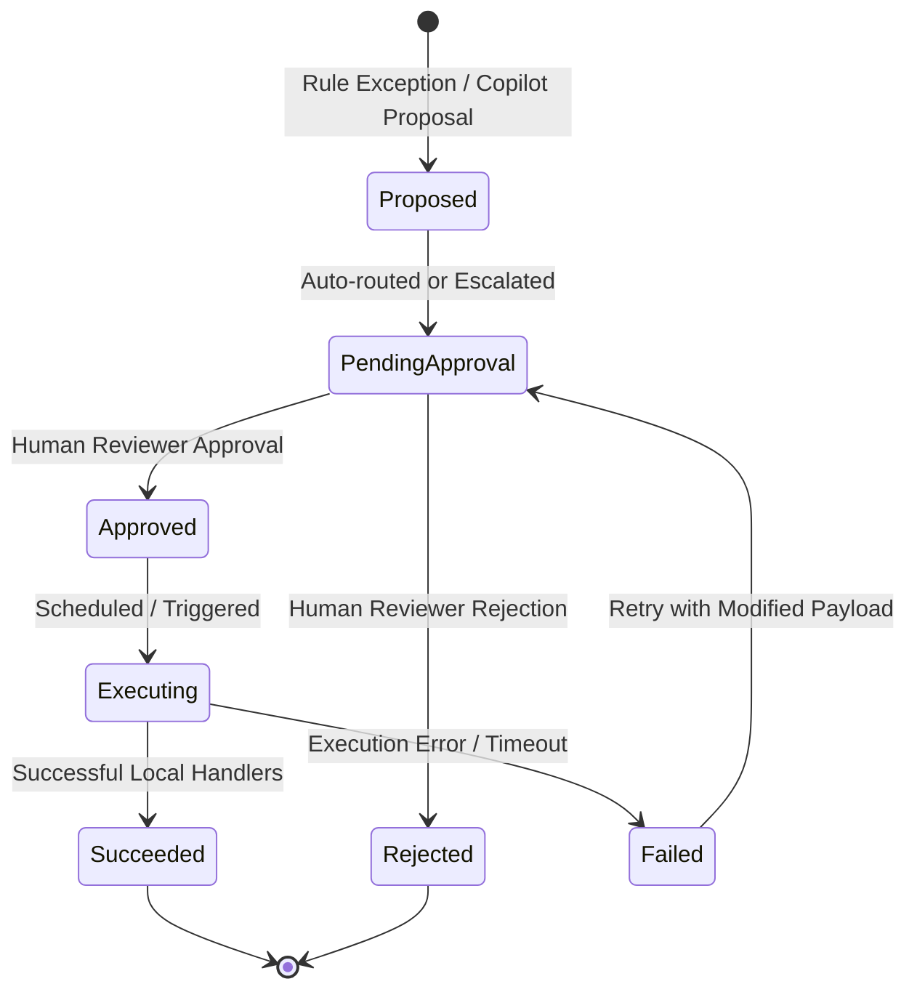
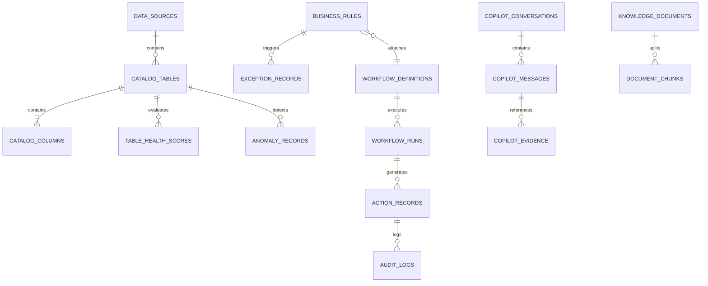

# OpsPilot Architecture Documentation

OpsPilot is an enterprise-grade AI Operations Copilot and operational intelligence SaaS platform designed to inspect operational data, detect problems, answer business questions, produce prioritized action lists, and execute human-approved workflows.

---

## 1. System Overview

OpsPilot bridges the gap between high-level executive inquiry, automated anomaly detection, deterministic business rules, and safe operational workflow execution. It employs a multi-tiered architecture that strictly decouples probabilistic language generation from deterministic data querying and mutation.

```mermaid
flowchart TD
    subgraph Client ["Client Layer (Modern React 19 + TypeScript)"]
        UI["OpsPilot Web Interface"]
        CP["Copilot Chat & Evidence Drawer"]
        DS["Data Source Ingestion & Profiler"]
        CAT["Semantic Data Catalog & Quality Health"]
        AC["Action Approval Center"]
        WF["Workflow Automation Studio"]
        EX["Exceptions & SLA Risk Monitor"]
        KB["Document Knowledge Base (RAG)"]
        RP["Report Generator (Excel/CSV/JSON)"]
        MR["Morning Operations Review Modal"]
    end

    subgraph API ["API & Gateway (FastAPI)"]
        Router["FastAPI REST & Streaming Router"]
        Safety["SQL Safety & Read-Only Validator (sqlglot AST)"]
        Audit["Audit Logger & Execution Tracker"]
        PII["PII Redaction & Data Minimizer"]
    end

    subgraph Core ["Operations Intelligence Core"]
        Orch["Operations Copilot Orchestrator"]
        Planner["Intent Classifier & Bounded Tool Planner"]
        
        subgraph Tools ["Deterministic & Analysis Tools"]
            ToolSQL["Safe SQL Analysis Tool"]
            ToolDF["Pandas In-Memory Analytics Tool"]
            ToolKPI["KPI Engine & Period Comparison"]
            ToolRule["Deterministic Business Rule Engine"]
            ToolAnomaly["Statistical Anomaly Detector (Z-Score/IQR/Rolling/IForest)"]
            ToolRAG["Document RAG & Citation Retriever"]
            ToolAction["Action Proposal & Approval Gate Engine"]
            ToolReport["Executive Reporting Engine (OpenPyXL)"]
        end

        Val["Result Grounding & Assertion Validator"]
        Composer["Response Composer & Confidence Calculator"]
    end

    subgraph Storage ["Persistence Layer"]
        InternalDB[("Internal SQLite Database (Alembic Managed)")]
        VectorStore[("ChromaDB Vector Store / In-Memory Cosine")]
        WarehouseDB[("Operational Warehouse Database (data/warehouse.db)")]
        ExternalData[("External Sources: CSV / XLSX / JSON / SQLite / PostgreSQL")]
    end

    UI --> Router
    Router --> Safety
    Router --> Orch
    Orch --> Planner
    Planner --> Tools
    ToolSQL --> WarehouseDB
    ToolDF --> WarehouseDB
    ToolRAG --> VectorStore
    Tools --> Val
    Val --> Composer
    Composer --> Router
    ToolAction --> AC
    AC --> Audit
    Audit --> InternalDB
```

---

## 2. Layered Architecture

### 2.1 Presentation Layer (Frontend)
- **Framework:** React 19 with TypeScript, bundled via Vite.
- **Styling & Components:** Tailwind CSS v4, Lucide React icons, Recharts data visualization.
- **Key Modules:**
  - **Dashboard View:** Real-time operational KPI metrics, critical anomaly widgets, SLA risk alerts, and Quick-Action launchpads.
  - **Copilot Interactive Workspace:** Chat interface with deep reasoning inspection, SQL query display, tabular evidence viewers, document citation drawer, and direct "Create Action" buttons.
  - **Data Catalog & Health Hub:** Automated schema profiling, semantic descriptions, 5-dimension quality health scores, and column-level distributions.
  - **Exceptions & SLA Monitor:** Filterable matrix of deterministic rule violations, SLA countdown breaches, and severity weighting.
  - **Action Approval Center:** Multi-step human-in-the-loop approval gate with dry-run verification, status filters (Pending, Approved, Rejected, Executed), and execution rollback/retry.
  - **Morning Operations Review:** Automated modal wizard summarizing overnight anomalies, urgent SLA breaches, critical pending actions, and daily operating health.

### 2.2 API & Gateway Layer
- **Framework:** FastAPI (Python 3.11+), asynchronous request handling with Uvicorn.
- **Pydantic Schemas:** Strict type contracts and validation for all inputs and responses.
- **Security Middleware:**
  - PII Redaction: Automatic masking of email addresses, phone numbers, and credit cards before forwarding text to external LLMs.
  - AST SQL Safety Validator: Syntactic and semantic query inspection blocking any mutating SQL dialect or multi-query batch.
  - Centralized Audit Logging: Every query, rule evaluation, action transition, and report generation is permanently recorded.

### 2.3 Operations Intelligence Core
- **Hybrid Reasoning Architecture:**
  - **Deterministic Tools First:** Quantitative operations (e.g., total overdue revenue, days delayed, stockouts) are calculated via exact SQL and Pandas code. The LLM is never permitted to guess or hallucinate numerical values.
  - **Semantic Context:** Unstructured policies, vendor agreements, and operating guidelines are indexed and retrieved using local dense vector embeddings with strict page and section citations.
  - **Synthesis & Explanation:** The generative model interprets the exact numbers and policy citations, producing structured operational diagnosis, root-cause analysis, and prioritized action proposals.

---

## 3. Engine Deep Dives

### 3.1 Safe Read-Only SQL Engine
The `SQLSafetyValidator` utilizes the `sqlglot` AST (Abstract Syntax Tree) parser:
1. **Single Statement Validation:** Ensures the query contains exactly one statement (rejects `; DROP TABLE`, semicolon injection, or chained commands).
2. **Expression Whitelisting:** Permitted root nodes are strictly limited to `exp.Select` or `exp.Union`.
3. **Blacklisted AST Nodes:** Any AST node matching `exp.Insert`, `exp.Update`, `exp.Delete`, `exp.Drop`, `exp.Alter`, `exp.Create`, `exp.Truncate`, or execution commands triggers immediate rejection.
4. **Keyword Interception:** Fallback regex scans prevent PRAGMA executions, transaction mutations (`BEGIN`, `COMMIT`), and dialect-specific execution wrappers.
5. **Execution Guardrails:** Queries are executed against read-only SQLite connections with configurable timeouts (default: 5.0 seconds) and automatic result-set capping (`LIMIT 500`).

### 3.2 Data Quality & Profiling Engine
Tables ingested into OpsPilot are analyzed across 5 core dimensions, resulting in an overall Health Score ($0 - 100\%$):
$$\text{Health Score} = 0.30 \times \text{Completeness} + 0.25 \times \text{Validity} + 0.20 \times \text{Uniqueness} + 0.15 \times \text{Timeliness} + 0.10 \times \text{Consistency}$$

- **Completeness ($30\%$):** Evaluates non-null ratios across primary and foreign key columns.
- **Validity ($25\%$):** Checks adherence to expected types, email formats, and positive numeric ranges.
- **Uniqueness ($20\%$):** Tests primary key candidate uniqueness and duplicate row rates.
- **Timeliness ($15\%$):** Analyzes date delta between newest record and current system time.
- **Consistency ($10\%$):** Checks cross-table referential integrity (e.g., `orders.customer_id` exists in `customers.id`).

### 3.3 Statistical Anomaly Detection
The `AnomalyService` supports four complementary mathematical detectors:
1. **Z-Score Detector:** Flags values where $|x - \mu| > k \cdot \sigma$ (default $k=3.0$).
2. **Interquartile Range (IQR):** Non-parametric detector flagging points outside $[Q_1 - 1.5 \times \text{IQR}, Q_3 + 1.5 \times \text{IQR}]$.
3. **Rolling Window Anomaly:** Computes trailing rolling mean and standard deviation to detect localized spikes or drops in sequential time-series data.
4. **Isolation Forest:** Multi-dimensional tree ensemble isolating unusual multidimensional operational outliers.

### 3.4 Deterministic Business Rule Engine
- Rules are defined with standard condition trees (e.g., `days_delayed > 5 AND status != 'delivered'`).
- Each violation creates an `ExceptionRecord` with calculated Priority Score:
$$\text{Priority} = (\text{Severity Weight} \times 0.5) + (\text{Impact Metric Weight} \times 0.3) + (\text{Time Aging} \times 0.2)$$
- Exceptions automatically link to pre-configured workflow actions (e.g., notify logistics carrier, send payment reminder).

### 3.5 Document RAG & Citation Engine
- **Chunking Strategy:** Markdown and text documents are split into recursive structural chunks preserving headers, section titles, and page markers.
- **Vector Index:** Chunks are embedded and stored in an indexed vector store. OpsPilot supports offline fallback embeddings for air-gapped deployments.
- **Citation Tracking:** Every retrieval result includes `document_name`, `page_number`, `section_title`, and `relevance_score`. LLM syntheses cite exact section references (e.g., `[Credit Policy §3.2]`).

### 3.6 Human-in-the-Loop Action Approval Gate
Automated operations can cause severe real-world harm if executed blindly. OpsPilot enforces a rigorous state machine for every operational action:

- **Execution Handlers:** Safe local mock handlers simulate external API actions:
  - `send_email`: Logs notification payload with recipient, subject, and body.
  - `webhook`: Sends structured JSON POST to registered operational endpoints.
  - `ticket_update`: Updates operational record status in internal database.
  - `slack_alert`: Formats and delivers real-time operational alerts.

---

## 4. Database Schema & Entity Relationships

The internal relational database (managed via SQLAlchemy and Alembic) tracks all operational metadata, catalog structures, rules, exceptions, workflows, and audit logs:

---

## 5. Security & Isolation Controls

1. **Read-Only Warehouse Isolation:** The analytical database connection has no write permissions.
2. **AST-Enforced SQL Querying:** Destructive statements are rejected before reaching SQLite.
3. **Human Gate on Mutations:** The AI model cannot execute write operations autonomously.
4. **PII Masking:** Personally Identifiable Information is redacted prior to external API calls.
5. **Immutable Audit Trail:** All human approvals and workflow executions are permanently recorded with timestamps, user IDs, and payload hashes.
