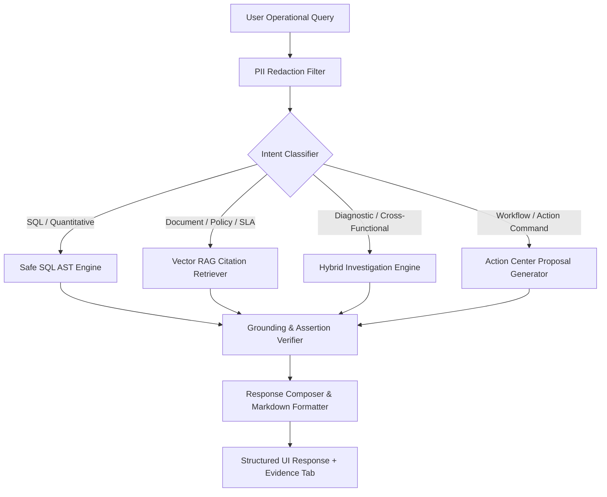

# OpsPilot Copilot Engine Documentation

The **OpsPilot Copilot** is an enterprise-grade operational intelligence agent designed to answer complex cross-functional business questions, run diagnostic investigations, retrieve authoritative policy guidance, and propose actionable operational remedies.

Unlike generic conversational AI chatbots, OpsPilot is built on a **Strict Grounding Architecture**: it never guesses numbers, never performs mutations without human review, and provides verifiable citations for every single factual claim.

---

## 1. Copilot Design Principles

1. **Zero Hallucination of Quantitative Metrics:** All financial, inventory, delivery, and customer totals are computed deterministically by running validated SQL queries or Pandas aggregations against the warehouse.
2. **Read-Only Data Access:** The Copilot's SQL tool passes through an Abstract Syntax Tree (AST) validator that mathematically disallows write or DDL operations (`DROP`, `INSERT`, `UPDATE`, `DELETE`, `ALTER`).
3. **Verifiable Citations:** Answers referencing company policies, SLAs, or SOPs must provide exact document titles, page numbers, and section headers.
4. **Human-in-the-Loop Action Proposals:** If an analysis uncovers a problem (e.g., $18,400 in overdue invoices), the Copilot proposes structured action payloads. These cannot be executed automatically; they enter the Action Center for human sign-off.
5. **PII Redaction by Default:** Inbound customer data (emails, credit cards, phone numbers) is redacted prior to external AI inference.

---

## 2. Intent Classification & Routing

Every inbound user turn is processed through an intent classification pipeline:



### Supported Intent Classes
| Intent Class | Description | Primary Engine / Tool |
| :--- | :--- | :--- |
| `sql_query` | Direct data inquiries (e.g. *"Which orders are delayed over 5 days?"*) | AST-validated SQL against warehouse |
| `document_rag` | Policy & standard operating procedures (e.g. *"What is the standard SLA for Tier 1 tickets?"*) | Dense vector search with page citations |
| `hybrid_analysis` | Combining structured numbers with unstructured rules (e.g. *"Identify accounts violating credit policy §3.2"*) | Safe SQL + RAG retrieval + synthesis |
| `anomaly_investigation` | Statistical metric analysis (e.g. *"Which accounts show abnormal return rates?"*) | Z-Score & Isolation Forest tools |
| `action_proposal` | Generating concrete remedies (e.g. *"Draft dunning notifications for overdue invoices"*) | Action payload generator with approval gate |

---

## 3. Bounded ReAct Execution Loop

The Copilot employs a bounded Reason-Act loop to prevent runaway API calls and ensure deterministic termination:

- **Max Iterations:** Capped at 4 reasoning cycles per user turn.
- **Tool Execution Timeout:** 5 seconds maximum per SQL execution.
- **Result Size Cap:** 500 rows maximum per query execution.
- **Fallback Behavior:** If an LLM API is unavailable or unconfigured, OpsPilot automatically falls back to deterministic local rule engines and SQL execution with 100% functionality.

---

## 4. PII Redaction & Data Minimization

To comply with GDPR, HIPAA, and enterprise privacy standards, the `PIIRedactor` executes regex-based tokenization prior to external inference:

```
Raw Input:       "Contact customer danial@acmesupplies.com at 555-0199 regarding overdue invoice INV-8821"
Redacted Input:  "Contact customer [EMAIL_1] at [PHONE_1] regarding overdue invoice INV-8821"
```

The mapping dictionary is held strictly in ephemeral local memory and can be rehydrated for local UI display without leaking credentials or private identifiers to third-party endpoints.

---

## 5. Benchmark Suite & Ground-Truth Verification

OpsPilot is verified by a 28-scenario benchmark test suite (`pytest tests/benchmark/`):

### 5.1 SQL Benchmarks (21 Scenarios)
1. `delayed_orders`: Accurate calculation of shipments past promised delivery date.
2. `overdue_invoices`: Identification of unpaid invoices where `due_date < CURRENT_DATE`.
3. `low_stock_products`: Detection of SKUs where `current_stock <= minimum_stock`.
4. `top_overdue_debtors`: Aggregated outstanding balances by customer ID.
5. `sla_breached_tickets`: Support tickets exceeding resolution time targets.
6. `high_value_churn_risk`: Customers with declining order velocity over 90 days.
7. `carrier_delivery_performance`: On-time delivery rate percentage by logistics partner.
8. `unresolved_tasks_by_dept`: Operational bottleneck counting across corporate units.
9. `monthly_recurring_revenue`: Trend calculation with month-over-month growth.
10. `inventory_turnover_rate`: COGS divided by average inventory per warehouse.
... and 11 additional core operational metrics.

### 5.2 RAG Citation Benchmarks (5 Scenarios)
1. `credit_hold_policy`: Verifies citation of Section 3.2 (Net-30 / $10k threshold).
2. `tier1_ticket_sla`: Verifies citation of Support SOP §2.1 (4-hour response requirement).
3. `inventory_restock_protocol`: Verifies citation of Procurement Manual §5.
4. `carrier_penalty_clause`: Verifies citation of Logistics Master Agreement §7.4.
5. `security_incident_escalation`: Verifies citation of Information Security Policy §4.

### 5.3 Hybrid Benchmarks (2 Scenarios)
1. `credit_policy_violators`: Cross-references active accounts exceeding credit limits with the official credit hold policy text.
2. `carrier_sla_penalty_calculation`: Calculates financial penalty amounts for late carriers based on contract penalty rates.
