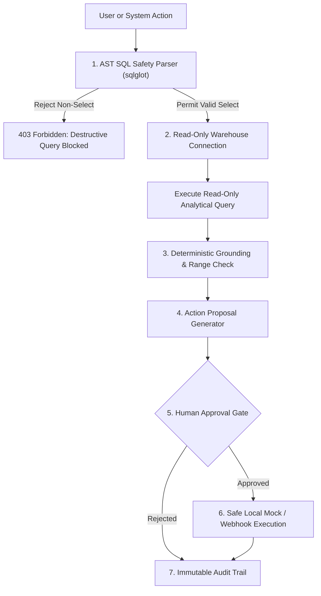

# OpsPilot Data Safety & Governance Architecture

In enterprise operations, AI safety is not merely about conversational moderation; it is about **preventing financial loss, data destruction, unauthorized mutations, and regulatory non-compliance**.

OpsPilot enforces a multi-layered, zero-trust safety framework ensuring that every query, data inspection, and workflow execution operates within strict boundaries.

---

## 1. The Operations AI Threat Model

When deploying AI agents against production operational data, four primary failure modes exist:

1. **Destructive Query Execution:** An LLM generates an `UPDATE`, `DELETE`, or `DROP` statement, corrupting operational tables.
2. **Hallucinated Operational Metrics:** An LLM generates believable but fictitious numbers (e.g., falsely claiming a vendor has zero overdue invoices), leading to costly business decisions.
3. **Ungoverned Action Execution:** An autonomous agent triggers automated notifications, emails, or payments without human verification.
4. **Data Privacy Leaks:** Customer PII (emails, phone numbers, credit information) is transmitted to third-party LLM APIs.

---

## 2. Multi-Layer Safety Controls



### 2.1 AST-Enforced Read-Only SQL Engine
OpsPilot inspects queries at the compiler syntax tree level using `sqlglot` before query execution reaches the database engine:

- **Statement Count Enforcement:** Rejects queries containing semicolons or multiple execution statements.
- **Root Node Whitelist:** Queries must parse to `exp.Select` or `exp.Union`.
- **Node Blacklist:** Recursively crawls AST children to ensure no occurrences of:
  - `exp.Insert`
  - `exp.Update`
  - `exp.Delete`
  - `exp.Drop`
  - `exp.Alter`
  - `exp.Create`
  - `exp.Truncate`
- **Dialect Injection Safeguards:** Blocks SQLite `PRAGMA` modifications and transactional commands (`COMMIT`, `ROLLBACK`, `ATTACH`).

### 2.2 Read-Only SQLite Connection Sandbox
Even if an AST validation bypass were theoretically possible, the underlying SQLite database connection is opened in strict read-only mode (`?mode=ro`). Attempted write operations raise database-level engine exceptions.

### 2.3 Deterministic Math & Grounding
OpsPilot strictly forbids LLMs from calculating financial metrics or sums directly in conversational context. All metrics are calculated using SQLite aggregate functions (`SUM()`, `AVG()`, `COUNT()`) or Pandas DataFrame algorithms. The LLM only interprets the structured results.

### 2.4 PII Redaction & Data Minimization
Before prompt text is dispatched to external inference endpoints, the `PIIRedactor` scans the query for:
- Email addresses (`[EMAIL_#]`)
- Telephone numbers (`[PHONE_#]`)
- Credit card / financial account numbers (`[ACCOUNT_#]`)

Identifiers are stored in an encrypted in-memory session table and re-hydrated only on the local client display.

---

## 3. Human-in-the-Loop Action Approval Gate

No operational action generated by OpsPilot can execute automatically without explicit human authorization:

```
[Copilot / Rule Engine]
       │ Proposes Action
       ▼
[Action Center: PENDING_APPROVAL]
       │
       ├─► [Human Reviewer: Dry Run Verification]
       │      │
       │      ├─► [REJECT]: Action cancelled with logged reason
       │      │
       │      └─► [APPROVE]: Authorized by operator
       │             │
       ▼             ▼
[Executor: EXECUTING] ──► [SUCCEEDED / FAILED]
```

### Key Approval Guardrails:
1. **Dry-Run Inspection:** Operators can preview the exact payload, target email, API endpoint, or modified values before granting approval.
2. **Role-Based Approvals:** High-severity actions (e.g., customer credit holds > $10,000) require operator confirmation.
3. **Idempotency Safeguards:** Every action has a unique UUID and payload hash to prevent double execution or race conditions.
4. **Reversible Execution Handlers:** Workflows implement failure handling, retry logic, and logged execution output.

---

## 4. Immutable Audit Trail

Every interaction within OpsPilot produces an unmodifiable audit event recorded in the internal database:

| Field | Description |
| :--- | :--- |
| `id` | Unique UUIDv4 event identifier |
| `timestamp` | ISO-8601 UTC timestamp |
| `user_id` | Operator or system identity |
| `action_type` | `QUERY_RUN`, `RULE_EVAL`, `ACTION_PROPOSE`, `ACTION_APPROVE`, `ACTION_EXECUTE`, `EXPORT` |
| `target_entity` | Table name, customer ID, order ID, or report ID |
| `payload` | Sanitized JSON representation of executed query or action |
| `status` | `SUCCESS`, `BLOCKED`, `FAILED`, `PENDING` |
| `execution_time_ms`| Precise latency tracking in milliseconds |
